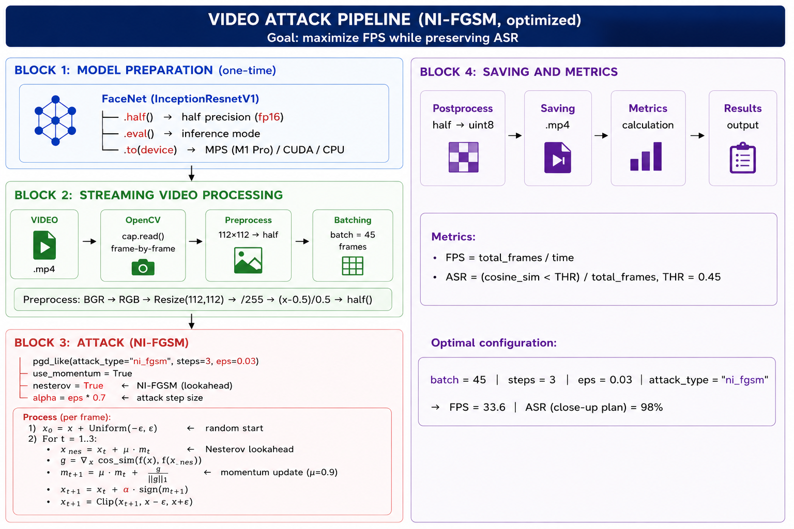
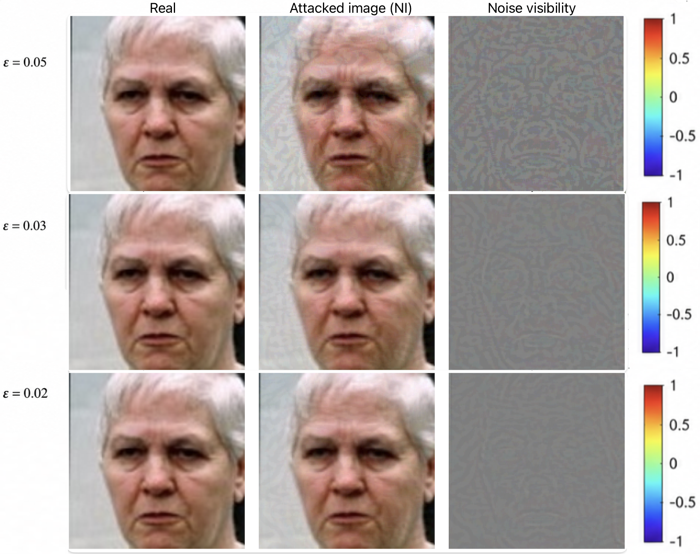

# Adversarial Attacks on Face Recognition Systems

Master's thesis: Adaptation of iterative gradient-based adversarial attacks (FGSM, PGD, MI-FGSM, NI-FGSM)
for real-time video pipelines in face recognition systems.

## Research Goal

Develop a methodology for adapting gradient-based adversarial attacks to real-time video pipelines
and evaluate the trade-off between attack effectiveness (ASR), visual imperceptibility (PSNR/SSIM),
and computational performance (FPS).

## Repository Structure

```

adversarial_pipeline/
├── examples/
│   ├── adversarial/
│   │   ├── epsilon_0.05_vs_003_vs_002.png   # Comparison of all ε levels
│   │   └── epsilon_002.png                   # Single attack example
│   └── deepfake_detection/
│       ├── inswapper_example_frame.png       # InSwapper face swap example
│       └── sdxl_example_frame.png            # SDXL diffusion-generated example
├── results/
│   ├── adversarial/
│   │   └── table_results.png                 # Quantitative results table
│   └── deepfake_detection/
│       └── deepfake_results_slide.png        # Detection results summary
├── schemas/
│   ├── attack_photo.png                      # Pipeline for static image attacks
│   ├── attack_video.png                      # Pipeline for video stream attacks
│   └── model_interseprion_cheme.png          # Model interception scheme
├── requirements.txt
└── LICENSE

```

## Pipeline Architecture

### Video Attack Pipeline



The pipeline includes:
1. Video capture and preprocessing (OpenCV, MTCNN)
2. Reference embedding extraction (InceptionResnetV1)
3. Adversarial perturbation generation (NI-FGSM with momentum and Nesterov acceleration)
4. Multi-metric evaluation (ASR, PSNR, SSIM, FPS)

### Key Optimizations for Real-Time Video

- **Batch processing:** batch_size = 45 for maximum GPU utilization (Apple M1/MPS)
- **Reduced iterations:** T = 3 (vs. T = 30 for static images)
- **Mixed precision:** float16 with automatic casting
- **Perturbation magnitude:** ε = 0.03 (optimal balance)

## Key Results

### Static Images (WebFace260M, 2000 samples)

| ε     | Attack   | ASR    | PSNR (dB) | SSIM  |
|-------|----------|--------|-----------|-------|
| 0.02  | NI-FGSM  | 75.45% | 38.89     | 0.963 |
| 0.03  | NI-FGSM  | 99.75% | 36.64     | 0.936 |
| 0.05  | NI-FGSM  | 100%   | 31.92     | 0.831 |

### Video Stream (CelebV-HQ, NI-FGSM, ε = 0.03)

| Video Type        | ASR    | FPS   |
|-------------------|--------|-------|
| Close-up (best)   | 98.0%  | 33.6  |
| Medium shot       | 70–80% | 33.6  |
| Small face (worst)| 42.9%  | 33.6  |

## Attack Visualization



Visual analysis of NI-FGSM attack at ε = 0.02, 0.03, and 0.05 (top to bottom).
Left: original, Middle: attacked, Right: amplified difference (×10).

**Key finding:** ε = 0.03 provides optimal balance — 99.75% ASR with visually imperceptible perturbations.

## Hardware

- Apple MacBook Pro M1 (MPS backend)
- NVIDIA RTX 3090 (server)

## Tech Stack

PyTorch, OpenCV, facenet-pytorch, torchmetrics, torchattacks, imageio

## License

© 2026 Perina Daria. All rights reserved.

This work is licensed under [CC BY-NC-ND 4.0](https://creativecommons.org/licenses/by-nc-nd/4.0/).
Any use beyond this license requires written permission from the author.

## Status

Master's thesis, 2026. Code available upon request.
```